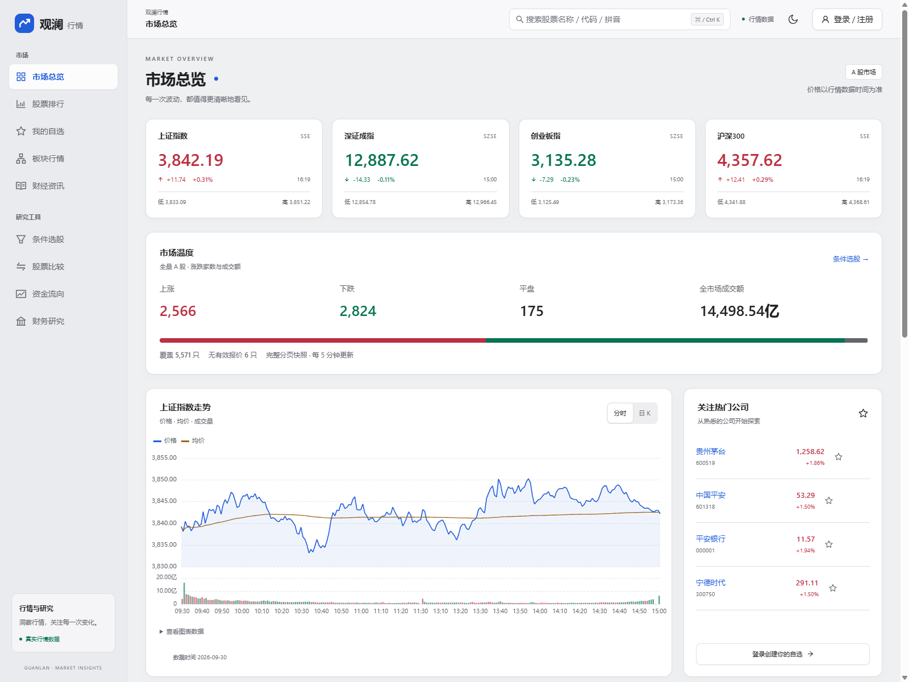
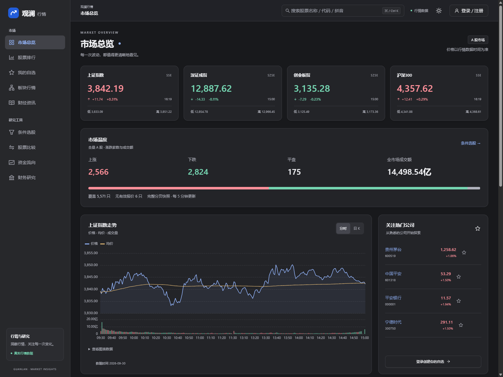
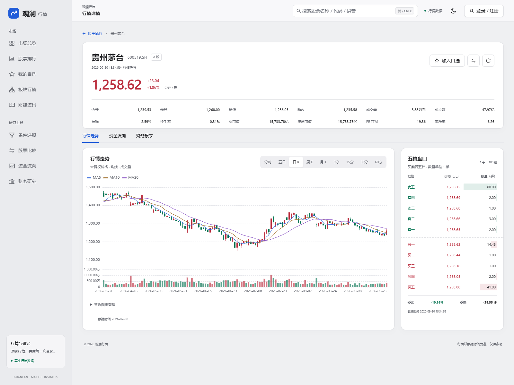
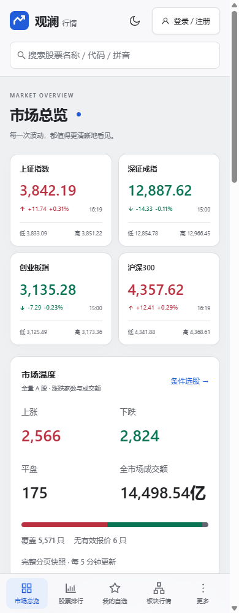

# 观澜行情

使用新浪财经公开接口构建的 A 股行情与财务研究网站。采用 macOS 软件风格的侧栏、工具栏和卡片，支持明暗主题、桌面与移动端，以及邮箱账号和独立自选股。行情全部来自真实接口，不使用演示数据。

## 项目效果图

以下截图于 2026-10-05 从本地运行的当前版本截取，使用真实接口数据。行情以页面标注的数据日期为准；图片保存在 `docs/screenshots/`，可点击查看原图。

### 市场总览 · 亮色主题

四大指数、全市场涨跌分布、成交额、分时走势与热门公司。



<details>
<summary>市场总览 · 暗色主题</summary>



</details>

### 行情详情 · K 线与五档盘口

行情快照、估值指标、日 K、MA5/10/20、成交量与买卖五档。



<details>
<summary>移动端 · 市场总览</summary>

390px 宽度下的指数卡片、市场温度与底部导航。



</details>

## 技术栈与 Next.js 规范

- Next.js 16 App Router、React、严格模式 TypeScript。
- Ant Design 6 与 `@ant-design/nextjs-registry`，按 [Ant Design 官方 Next.js 接入方式](https://ant.design/docs/react/use-with-next/)注入首屏样式。
- ECharts 按需加载价格线、成交量、K 线、财务及资金图表。
- SWR 管理浏览器数据请求、轮询和账号隔离缓存；Zod 验证账号输入和 API 查询参数。
- Node 内置 SQLite 持久化账号、会话、自选股；Node crypto 的 scrypt 保存密码哈希。
- ESLint、Prettier、Node Test Runner、Playwright 做质量检查。

`src/app` 的 `page.tsx`、`layout.tsx` 默认是 Server Components；交互组件在 `src/components` 中显式标记 `use client`。遵循 [Next.js 服务端与客户端组件规范](https://nextjs.org/docs/app/getting-started/server-and-client-components)，数据库、会话和新浪请求模块通过 `server-only` 限定服务端使用。`params`、`searchParams` 和 `cookies()` 异步读取；API 使用 `app/api/**/route.ts` 与 Node.js runtime；页面使用 Next Link、metadata、loading、error、not-found 约定。

## 启动

需要 Node.js 22.12 以上；建议使用较新的 Node.js 22 或 24 LTS。Node 22.12 的 SQLite 需要实验开关，npm 脚本已包含 `--experimental-sqlite`。

```bash
npm install
npm run dev
```

打开 <http://127.0.0.1:3000>。首次注册会自动创建数据库，注册完成即登录。

可将 `.env.example` 复制为 `.env.local`，修改 `DATABASE_PATH`；默认 `./data/stock.db`。数据库文件与凭证不应提交到 Git。无需第三方 API Key、邮件服务或外部数据库即可在本地运行。

生产运行：

```bash
npm run build
npm run start
```

当前 SQLite 方案面向单个 Node 服务实例和持久磁盘，不适用于只读文件系统或多个无状态实例。上线时需要 HTTPS、保留数据库卷，并让反向代理正确转发协议与域名，以便同源校验和 Secure Cookie 生效。多实例部署需迁移到共享数据库和共享限流存储。

## 已实现功能

| 页面                  | 功能                                                               |
| --------------------- | ------------------------------------------------------------------ |
| `/`                   | 四大指数、全市场涨跌家数与成交额、上证分时和日 K、热门公司、资讯、三类排行 |
| `/market`             | 全部 A 股、沪市、深市、创业板、科创板筛选；接口排序与分页          |
| 全局搜索              | 名称、代码、拼音查询沪深北证券，进入详情                           |
| `/watchlist`          | 登录保护、账号独立收藏、实时行情、排序与 CSV 导出                  |
| `/stock/sh600519`     | 行情快照、估值、股本、五档盘口、分时、K 线、资金与财务             |
| `/funds`              | 四类成交方向资金净流入、流入与流出对比                             |
| `/financials`         | 关键指标、利润表、资产负债表、现金流量表，最近八期对比与指标搜索   |
| `/sectors`            | 行业与概念图谱、搜索、排行、完整成分分页与排序、领涨股、自选操作   |
| `/screener`           | 全市场条件选股；沪深北、创业板、科创板；价格、涨跌、估值、市值、换手、成交额筛选 |
| `/compare`            | 1–4 只证券比较；20/60/120/240 个共同交易日、同起点走势、区间涨跌与最大回撤 |
| `/news`               | 新浪财经、股市、环球资讯；分类、分页、原始媒体署名、时间与原文链接 |
| `/login`、`/register` | 邮箱密码注册、登录、退出，七天服务端会话                           |

分时提供最近五个交易日，图表附有可展开的数据表。K 线提供日、周、月及 5/15/30/60 分钟周期、MA5/10/20 和成交量；周/月从最多 500 根日线聚合，显示范围取决于源数据。所有 K 线均为未复权价格，未提供前后复权或完整历史下载。

条件选股先抓取完整 A 股分页快照，再筛选、排序、分页，首页涨跌家数也使用该快照，不以热门股票样本推算全市场。分页抓取并非交易所同一毫秒的原子快照；首次获取可能需要数秒。比较走势只采用所选证券共有的有效交易日，不填补缺失日期；未复权涨跌不等同于含分红总回报。

板块保留三种独立数量：`total` 是逐页抓取并去重的实际成分数，`sourceStockCount` 是新浪数量接口统计，`sector.reportedStockCount` 是汇总榜统计。部分概念汇总榜最多统计 100 只样本，源榜涨跌幅、成交额和领涨股不保证覆盖全部成分；界面明确标注样本口径，完整成分成交额、成交量及领涨股另行计算。概念成分可重叠，跨板块合计会重复统计证券。

顶部搜索支持 `Cmd / Ctrl + K`。明暗主题持久化，图表随主题更新；窄屏采用底部导航，研究工具可从“更多”进入。资讯仅展示标题、时间、出处和新浪 HTTPS 原文链接。

账号首版包含邮箱密码和昵称，暂未接入邮箱验证、找回密码或第三方登录。密码使用随机盐 scrypt；浏览器持有 HttpOnly / SameSite=Lax 会话 Cookie，数据库只保存令牌摘要。接口从会话决定用户身份，不接受客户端传入的用户 ID；注册登录有单进程限流，写操作有同源校验。

## 接口与字段注释

前后端方法均使用中文 JSDoc 描述用途与关键口径；`src/lib/types.ts` 定义通用响应，`sector-types.ts`、`screener.ts`、`compare.ts`、`news.ts` 定义研究模块响应，逐字段注明单位、缺失值和日期语义。查询参数如下：

| 方法与接口                                     | 参数                                                                                                             | 数据类型                   |
| ---------------------------------------------- | ---------------------------------------------------------------------------------------------------------------- | -------------------------- |
| `GET /api/market/quotes`                       | `symbols`：逗号分隔，1–60 个带交易所前缀的代码                                                                   | `ApiResult<Quote[]>`       |
| `GET /api/market/list`                         | `node=hs_a/sh_a/sz_a/cyb/kcb`；`sort=changepercent/amount/turnoverratio/mktcap/symbol`；`asc=0/1`；`page=1..500` | `ApiResult<MarketList>`    |
| `GET /api/market/search`                       | `q`：1–40 字符                                                                                                   | `ApiResult<SearchStock[]>` |
| `GET /api/market/minutes`                      | `symbol`                                                                                                         | `ApiResult<MinuteDay[]>`   |
| `GET /api/market/candles`                      | `symbol`；`scale=5/15/30/60/240`，240 为日线                                                                     | `ApiResult<Candle[]>`      |
| `GET /api/market/funds`                        | `symbol`                                                                                                         | `ApiResult<Funds>`         |
| `GET /api/market/financials`                   | `symbol`；`source=gjzb/lrb/fzb/llb`                                                                              | `ApiResult<Financials>`    |
| `GET /api/breadth`                            | 无，使用完整 A 股快照                                                                                             | `ApiResult<MarketBreadth>` |
| `GET /api/screener`                           | `market=all/sh/sz/bj/cyb/kcb`；名称或代码 `query`；筛选、排序、页码见下文                                          | `ApiResult<ScreenerResult>` |
| `GET /api/sectors`                            | `type=industry/concept`；可选 `node` 与排序分页参数                                                               | `ApiResult<SectorList或SectorConstituents>` |
| `GET /api/compare`                            | `symbols`：1–4 个有效代码；`days=20/60/120/240`                                                                   | `ApiResult<ComparisonResult>` |
| `GET /api/news`                               | `category=finance/stocks/world`；`page=1..100`                                                                    | `ApiResult<NewsResult>` |
| `GET /api/auth/me`                             | 无                                                                                                               | `AuthResult`               |
| `POST /api/auth/register`                      | JSON：`email`、`password`（8–128 字符）、`name`（1–24 字符）                                                     | `AuthResult`               |
| `POST /api/auth/login`                         | JSON：`email`、`password`                                                                                        | `AuthResult`               |
| `POST /api/auth/logout`                        | 无                                                                                                               | `MutationResult`           |
| `GET /api/watchlist`                           | 需要登录                                                                                                         | `WatchlistResult`          |
| `POST /api/watchlist`、`DELETE /api/watchlist` | JSON：`symbol`，需要登录                                                                                         | `MutationResult`           |

失败响应统一为非 2xx HTTP 状态和 `{ error: string }`。行情响应包含 `meta.source`、`meta.fetchedAt`、`meta.stale`，界面另展示实际交易/报告日期。`fetchedAt` 是本服务抓取时间，不能当作行情发生时间。

选股可选边界：`minPrice/maxPrice`、`minChange/maxChange`、`minPe/maxPe`、`maxPb`、`minTurnover/maxTurnover`、`minCap/maxCap`、`minAmount`。价格单位元，涨跌和换手单位百分比数值，估值单位倍，市值和成交额 API 单位元（界面亿元）。`profitable=1` 仅保留正 PE，`excludeSt=1` 排除名称含 ST 的证券；`sort=changePercent/amount/turnover/marketCap/pe/pb/price`，`order=asc/desc`，`page=1..750`，每页 20 条，缺失值排序置后。下限超过上限返回 400。

板块成分参数为有效目录 `node`、`sort=changepercent/amount/turnoverratio/mktcap/symbol/trade`、`asc=0/1`、`page=1..500`；对完整成分快照排序后每页返回 20 条，超出末页返回空列表。

金额统一为元，成交量统一为股，盘口展示为手时除以 100。排行市值原始万元、扩展股本原始万股在服务端转换。涨跌幅 `1.86` 表示 `1.86%`；财务同比 `0.1` 表示 `10%`。缺失值保留 `null`，不会用 0 伪造指标。排行 PE 与详情 PE TTM 可能口径不同；财务利润和现金流量为各报告期累计值。

沪市指数行情快照的原始成交量为手，服务端乘以 100；深市指数行情快照已为股。所接入的个股及指数日线、分钟 K 线成交量均已为股，不再乘以 100。

## 新浪数据接入依据与边界

实际请求接通的公开来源：

- `hq.sinajs.cn`：行情及扩展字段，提供五档盘口。
- `vip.stock.finance.sina.com.cn/quotes_service/api/json_v2.php/Market_Center.getHQNodeData`：排行，配套 `getHQNodeStockCount` 获取数量。
- `money.finance.sina.com.cn/.../CN_MarketData.getKLineData`：未复权日线和分钟线。
- `finance.sina.com.cn/realstock/company/{symbol}/hisdata/klc_cm.js`：最近五日压缩分时。根据新浪 SDK 136 格式解码，移除午间重复槽，支持指数大成交量。
- `suggest3.sinajs.cn`：股票搜索建议。
- `MoneyFlow.ssi_ssfx_flzjtj`：按成交方向分类的资金统计，不能解释为账户实际资金转账。
- `quotes.sina.cn/.../CompanyFinanceService.getFinanceReport2022`：关键指标与三张财务报表。
- `vip.stock.finance.sina.com.cn/q/view/newSinaHy.php`、`newFLJK.php?param=class`：行业与概念汇总，成分查询使用行情分页接口。
- `feed.mix.sina.com.cn/api/roll/get`：按[新浪财经滚动页](https://finance.sina.com.cn/roll/)实际分类获取财经、股市和环球资讯。

服务端处理 Referer 和 GB18030 编码，解析 JSON/字符串而不执行返回脚本。上游 URL 固定，用户仅能输入经验证的代码与枚举参数。缓存行情 5 秒、排行与板块汇总 10 秒、分时 30 秒、K 线/资金/板块完整成分/资讯 60 秒、搜索与全市场快照 5 分钟、财务 6 小时；并发相同请求合并。上游失败时，期限内的缓存可降级返回，并在界面提示；没有缓存时显示错误和重试入口，不注入演示行情。分时文件已核对当日收盘数据，但源站盘中更新频率没有保证，界面始终显示实际数据日期。

公开免费接口能支撑当前功能，但并非具有 SLA 的正式授权服务，部分证券没有完整资金或财务数据，接口格式和访问条件也可能变化。商业公开运营前需确认数据使用授权；若需要稳定实时数据或复权完整历史，应接入有授权的行情服务。当前覆盖 A 股、选定指数及财经资讯，未实现港美股、研报全文或证券交易。

## 验证

```bash
npm run typecheck
npm run lint
npm run test
npm run build
npm run test:e2e
```

E2E 使用本机 Chrome，在 3002 端口启动生产服务，并单独使用 `data/e2e.db`；运行前先完成构建。设置 `E2E_BASE_URL` 可连接已有调试实例，此时账号将写入该实例所用数据库。30 项浏览器测试覆盖原九项功能、新增研究模块、所有 K 线周期、真实大板块完整分页、账号隔离和并发上限、失效会话、参数校验、错误重试、缓存降级、资讯链接、主题和 375px 布局。20 项单元测试无需网络，覆盖字段单位、分时解码、密码、选股、比较和安全链接。浏览器测试依赖真实新浪网络，可能受到上游可用性影响。

## 目录

```text
src/app/          App Router 页面、布局、状态边界、Route Handlers
src/components/  页面交互、Ant Design 组件、图表与主题上下文
src/lib/types.ts 已注释的共享接口字段与单位
src/lib/sina/    新浪请求、缓存、数据规范化、分时解码
src/lib/         板块、选股、比较、资讯的已注释类型与计算逻辑
src/lib/auth.ts  服务端会话
src/lib/db.ts    SQLite 表初始化与连接
tests/unit/      无网络单元测试
tests/e2e/       真实浏览器与账号隔离测试
```
